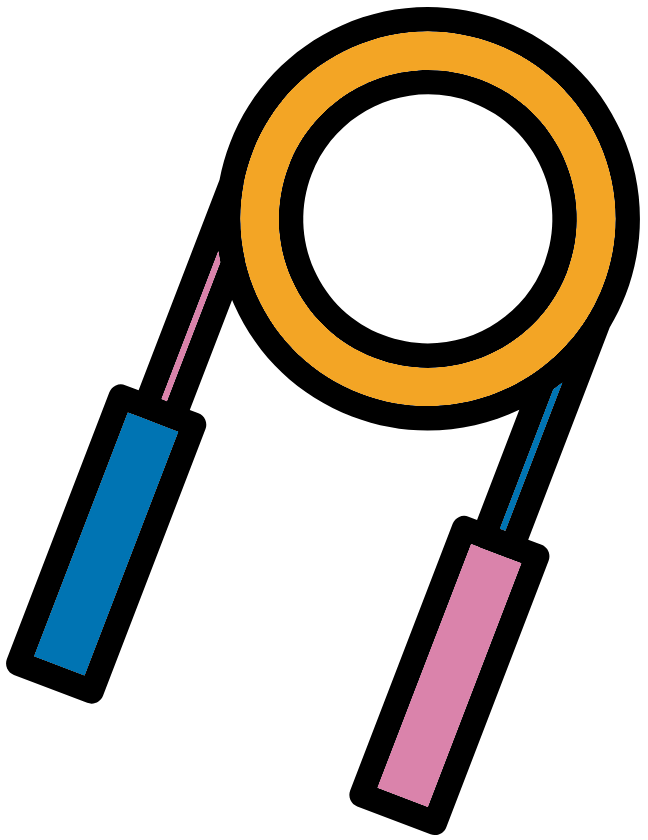

```{r cite-packages, include = FALSE}
# automatically create a bib database for R packages
# add any packages you want to cite here
knitr::write_bib(c(
  .packages(), 'bookdown', 'webexercises'
), 'packages.bib')
#Below code block sets style to be used in python code blocks
#This is to give it a border so each cell is more obvious
#https://bookdown.org/yihui/rmarkdown-cookbook/chunk-styling.html
```

```{r, echo=FALSE}
#Change colour, border, and text of code chunks
#Check style.css for .Rchunk
#https://stackoverflow.com/questions/65627531/change-r-chunk-background-color-in-bookdown-gitbook
#https://bookdown.org/yihui/rmarkdown-cookbook/chunk-styling.html
knitr::opts_chunk$set(class.source="Rchunk") 
```

<center>{width=30%}</center>

# (PART\*) Intro {-}

# Introduction

<center>{width=30%}</center>

In this practical session we are going to learn Python programming skills. This will cover the fundamentals of Python coding and several Python tools focused on data manipulation. Whilst we will be working mostly with DNA sequence data, the methods and approaches can be modified to work with most types of data.

During this session we will work through the following sections:

```{r, echo=FALSE, align="centre"}
#Create 2 coilumn dataframe
column_1 <- c(
 '[Course Introduction](#intro)', 
 '[{height="150"}](#intro)',
 '[Jupyer-notebook](#jupyter)',
 '[{height="150"}](#jupyter)',
 '[Python Fundamentals](#python_fundamentals)',
 '[{height="150"}](#python_fundamentals)',
 '[Data Structures](#data_structures)',
 '[{height="150"}](#data_structures)',
 '[Conditions (if and else statements)](#python_conditions)',
 '[{height="150"}](#python_conditions)',
 '[Working with DNA Sequence Data](#reading_seq_data)',
 '[{height="150"}](#reading_seq_data)',
 '[Reading and Writing Files](#reading_writing)',
 '[{height="150"}](#reading_writing)',
  '[Final exercises](#fundrecapexercise)',
 '[{height="150"}](#fundrecapexercise)'
)
column_2 <- c(
  '[Working in the VNC](#cluster)',
 '[{height="150"}](#cluster)',
 '[Scripting in Python](#scripting)',
 '[{height="150"}](#scripting)',
 '[Functions and methods](#functions_methods)',
 '[{height="150"}](#functions_methods)',
 '[Fundamental exercise](#fundamental_exercise)',
 '[{height="150"}](#fundamental_exercise)',
 '[Loops](#loops)',
 '[{height="150"}](#loops)',
 '[Manipulating Sequence Data](#modify_dna_data)',
 '[{height="150"}](#modify_dna_data)',
 '[Logical operators](#logical_operators)',
 '[{height="150"}](#logical_operators)',
   '[Appendix](#further_resources)',
 '[{height="150"}](#further_resources)'
)
table_df <- data.frame(column_1, column_2)
#Kable and kableextra libraries
library(knitr)
library(kableExtra)
#Create table
#ALign both column in centre (align = "cc")
table_df %>%
  kbl(align= "cc", col.names = NULL) %>%
  kable_styling(position = "center")
```

<a rel="license" href="http://creativecommons.org/licenses/by-nc-sa/4.0/"></a><br />This work is licensed under a <a rel="license" href="http://creativecommons.org/licenses/by-nc-sa/4.0/">Creative Commons Attribution-NonCommercial-ShareAlike 4.0 International License</a>.