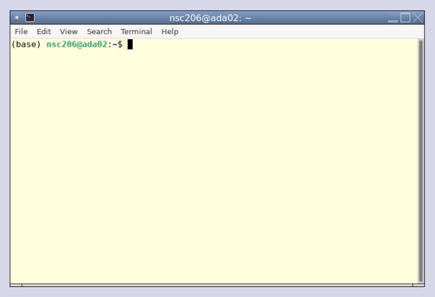

# Cluster Introduction {#cluster}

<center>{width=25%}</center>

## Logon Instructions
For this workshop we will be using Virtual Network Computing (VNC). 
Connect to the VNC with a browser by using the webVNC link you were sent.

You will now be in a logged-in Linux VNC desktop with a terminal window visible. 
You will see something as below. 
<center>{width=75%}</center>

If you do not see something similar please ask for assistance.

If the VNC is taking up too much/little space of your browser you can use the zoom of your browser to adjust the size. Ensure you can see one whole terminal.

## The Terminal Window
In our case the terminal window looks like the picture below. We are using the terminal window as our shell to interpret our commands to the kernel. Depending on your system and preferences it may look different.

<center>{width=75%}</center>

You're now ready to start the workshop!

## Load workshop data
Before we get started, we need to copy across some data files to analyse later in the workshop.

In the terminal window, issue the following commands to copy the data into your account:

```{bash, eval=FALSE}
cd ~
cp -r /pub14/tea/nsc206/NEOF/Python_course_data .

```

## Mamba
```{r, fig.align = 'center',out.width= '20%', echo=FALSE }
knitr::include_graphics(path = "figures//mamba_logo.png", auto_pdf = TRUE)
```

This workshop requires some programs. 
These can be difficult to install. 
Instead we have used Mambaforge to install the programs including Jupyter-notebook. 
To learn more about Mambaforge and how to create your own environment please see the [appendix](#mamba_install).

To set-up your environment for this workshop please run the following code (you must include the full stop and space at the front of the command).

```{bash, eval=FALSE}
. usepython
```

You will have successfully activated the environment if you now see `(python)` at the start of your command prompt. 
This indicates you are now in the mamba environment called `python` created by the instructor.

If you are interested in the use script you can look at its contents.

```{bash, eval=FALSE}
less /usr/local/bin/usepython
```

__Tip:__ press `q` to quit `less`.

For more about mamba and how to create your own `python` environment please see the [appendix](#mamba_install)