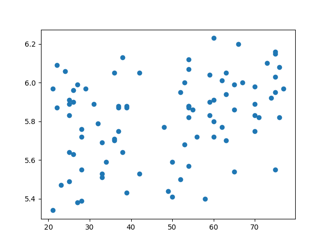

# Plotting using Python and Matplotlib {#matplotlib}
<center>{width=40%}</center>

We can also use Python to produce plots of our data.
[Matplotlib](https://matplotlib.org/) is a library of powerful
plotting tools.

## Import Matplotlib
Add a new line to the <b>top</b> of your __notebook__ (**"10-Pandas"**). We need to import a new library: __matplotlib__, and specifically the __pyplot__ suite of functions.

```{python, eval=FALSE}
import matplotlib.pyplot as plt
```

## Bar Chart
Again, considering the __"patients.csv"__ dataset, let's see which is the most common bmi group and generate a bar chart.

At the bottom of the notebook, add and run the following. We are using the `.value_counts()` __method__ to count how many individuals are in each group.

```{python, eval=FALSE}
#Calculate number in each bmi group
bmi_counts = (patients['bmi_group'].value_counts())
print(bmi_counts)
```

We can then use __Matplotlib__ to plot this data in order to visualise these groups. To our __bmi_counts__ data we apply the `.plot()` method, and specify that we would like a bar chart (`kind='bar'`). 

```{python, eval=FALSE}
#Generate the plot
bmi_counts.plot(kind='bar')
#Automatically adjust borders to fit axis ticks
plt.tight_layout()
```

We can also save the plot as a PNG file.

```{python, eval=FALSE}
#Generate the plot
bmi_counts.plot(kind='bar')
#Automatically adjust borders to fit axis ticks
plt.tight_layout()
#Save the plot to a png file
plt.savefig('bmi_groups.png')
#Close the plotting device
plt.close()
```

You can then open the file in your `jupyter-notebook` explorer tab.

<center>{width=80%}</center>

## Scatter plot
We can also look for relationships between a pair of variables. Consider the age and diversity of gut microbiome of the first 100 patients (for clarity).

```{python, eval=FALSE}
#Generate the scatter plot of the first 100 rows
plt.scatter(patients.age[0:99], patients.diversity[0:99])
#Write the plot to the disk
plt.savefig('age_diversity_plot.png')
#Close the plotting device
plt.close()
```

View the plot and you should see the below.

<center>{width=80%}</center>

## Recap
__Madplotlib__ is a __library__ of very powerful tools to produce plots directly from Python. We have barely scratched the surface of what __Matplotlib__ can do but have seen a couple of examples of how we can produce plots to explore our data.